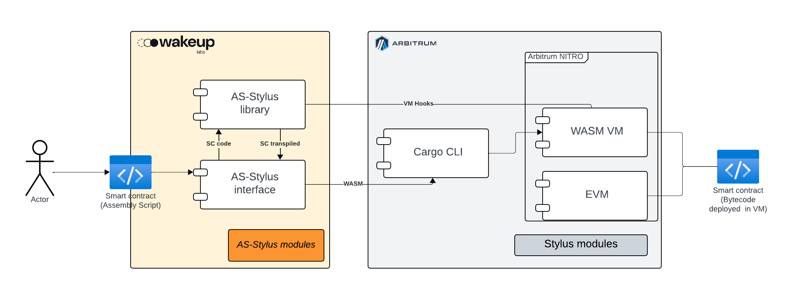

<p align="right">
  
</p>

# Stylus: Feasibility Report

## Executive Summary

This project explores the feasibility of enabling developers to write Arbitrum Stylus smart contracts using AssemblyScript. While Stylus was originally designed with Rust in mind, its WebAssembly-based architecture allows for alternate languages.

We present a developer-focused SDK that streamlines the experience for JavaScript/TypeScript developers by offering tools to write and deploy Stylus-compatible contracts using familiar AssemblyScript syntax. The project includes CLI tooling, entrypoint code generation, and integration with the main features of the cargo stylus workflow

## Introduction

### Purpose

To explore the feasibility of enabling developers to use AssemblyScript to write and deploy Stylus contracts, providing an alternative to Rust with a focus on developer ergonomics and integration with modern JavaScript tooling.

### Scope

This report covers:
- Design of developer-facing tooling
- CLI-based build flow to transform AssemblyScript into valid Stylus-compatible WASM
- Auto-generation of entrypoints and selector logic
- Integration with `cargo stylus check` and `deploy`

### Motivation

To grow the Stylus VM ecosystem, it's crucial to lower entry barriers and improve the developer experience. In this context, using an SDK with code generation stands out as a particularly effective approach.

**SDK + Generator**

This setup allows developers to write contracts in AssemblyScript in a clean, expressive way—without needing to deal with low-level details or repetitive boilerplate. The generator handles the translation of high-level structures into the interfaces expected by the VM, which:

- Accelerates development by reducing the amount of manual code required
- Improves maintainability by centralizing repetitive logic in automated tooling
- Onboards JavaScript/TypeScript developers more easily, since they’re already familiar with the language and its ecosystem

By adopting this approach, we not only simplify the technical workflow but also open the door to a much broader community—one that's aligned with modern web development practices. This makes it easier for new teams to experiment, contribute, and build on the network without facing a steep learning curve.

## Glossary

- **SDK** – Software Development Kit
- **DX** – Developer Experience
- **WASM** – WebAssembly binary format
- **ABI** – Application Binary Interface
- **Entrypoint** – Main function exposed to the Stylus VM for dispatch
- **asc** – AssemblyScript compiler
- **.dist/** – Folder containing the wrapped contract logic and generated entrypoint
- **vm_hooks** - Host functions provided by the Stylus VM

## Objectives and Requirements

### Technical Goals

- Enable basic Stylus-compatible contracts in AssemblyScript
- Autogenerate dynamic dispatchers based on contract exports
- Support `cargo stylus check` and `cargo stylus deploy`
- Provide CLI for initialization, build, and deployment

### Functional & Non-functional Requirements

- Minimal developer setup
- Avoid AssemblyScript GC/runtime usage
- Use `vm_hooks` host functions for all external IO
- Enforce memory-safe interactions with the Stylus VM
- Maintain high DX with readable output and clear error surfaces

## Architecture and technologies

### ⚠️ Disclaimer

This is a high-level architecture intended as a starting point for development. During the implementation process, components or technologies may be modified, added, or removed as needed. All such decisions will be documented along with clear explanations to ensure transparency and traceability.

### Proposed Architecture



### AssemblyScript Stylus (AS-Stylus Library)

This component defines the core layer for writing Stylus smart contracts in AssemblyScript. It provides the necessary abstractions and boilerplate to simplify the developer experience, while guiding the structure and syntax of contract code.

Designed to be lightweight, composable, and framework-agnostic, the component includes:

- Utility functions and decorators (e.g. `@entry`, `@view`) that reduce complexity and boilerplate.
- Typed bindings to Stylus host functions, enabling interaction with storage, calldata, and execution context.
- A consistent development model that enforces best practices and improves readability.
- Provides typed utility functions, decorators or similar AssemblyScript resource (e.g., `@entry`, `@view`, etc.) to simplify contract logic.
- Ensures compatibility between AssemblyScript and Stylus runtime expectations.

In essence, the component frames the developer's interaction with the Stylus VM, shaping how smart contracts are authored and encouraging clean, maintainable patterns.


### AssemblyScript Interface (AS-Stylus Interface)


The interface component is designed to streamline the developer experience by automating project setup and abstracting away repetitive build tasks. It acts as the bridge between developers and the Stylus toolchain, simplifying the process of building and deploying AssemblyScript contracts.

- `generate <name>`: Scaffolds a new Stylus project using AssemblyScript, including the recommended folder structure and boilerplate code.
- `build`: Compiles the project to WebAssembly (WASM) and prepares the output required by the Arbitrum Stylus environment.


Although this is a high-level definition, the *developer interface* may include additional logic such as validations, code generation, and interfacing with external tools. In particular, it may rely on the cargo CLI to invoke cargo stylus, enabling interaction with the Stylus VM on Arbitrum.

----

The architecture is intentionally modular and extensible, allowing the project to grow with features like testing, simulation, and advanced deployment workflows.


### Technologies Used

- AssemblyScript compiler (`asc`)
- Node.js and external libraries (for CLI scripting)
- Stylus CLI (`cargo stylus`) – installed globally as a Cargo subcommand

These tools were sufficient for the initial proof-of-concept phase. However, more detailed or production-level implementations may require adding or modifying some of these technologies.


### Developer Experience

The following diagram provides a draft of how the different components interact:


In this architecture, the `as-stylus-interface` acts as the primary interface for the developer, simplifying interaction with the underlying toolchain during the post-development lifecycle, such as building, checking, and deploying.

`as-stylus-library` instead, will cover all the abstractions and language definition. It will be more used in development time.

Note that this is the current architecture for the early stage of the project, and it is expected to evolve as we dive deeper into the implementation and refine the tooling.


## Proof of Concept

To help clarify and define a clear technical scope, we conducted a series of strategic proof-of-concept implementations. This process was key to evaluating different SDK implementations (Rust and C) and initiating the development of WebAssembly (WASM) code using AssemblyScript.


### ⚠️ Disclaimer: Limitations of the Current Implementation


The primary goal of this proof of concept was to validate the feasibility of the implementation. At this stage, non-functional requirements such as developer experience, performance, and others were not the focus. These aspects will be refined and optimized during the development phase.

It is important to note that the current implementation is not final. In subsequent phases, we will carefully analyze, test, and refine the solution for each feature to ensure the best possible outcome.

### Entry point

Every Stylus smart contract requires an entrypoint function, which serves as the execution starting point for the virtual machine (VM). Without a defined entrypoint, the contract will fail validation during compilation.

As a proof of concept, we implemented a minimal `user_entrypoint` in AssemblyScript that allows successful deployment and basic interaction with the Stylus VM. This entrypoint acts as a dispatcher, routing execution to different internal functions based on a selector byte.

This integration with the VM has the following considerations:
- Entrypoint is always `export function user_entrypoint(args_len: usize): i32`
- Function selector handled using conditional `if` statements
- Imports host functions (`read_args`, `write_result`, etc.) from `vm_hooks`
- Manages memory manually using `memory.grow` (no GC)

```ts=
export function user_entrypoint(args_len: usize): i32 {
  const position = memory.grow(<i32>(args_len + 0xffff) >> 16);
  read_args(position);

  const selector = load<u8>(0);
  let result: u64 = 0;

  if (selector == 0x01) {
    result = increment();
  } else if (selector == 0x02) {
    result = decrement();
  } else if (selector == 0x03) {
    result = get();
  } else if (selector == 0x04) {
    reset();
  } else {
    return 1; // unknown selector
  }

  write_result(result as usize, sizeof<u64>());
  return 0;
}
```

#### Design Considerations

This basic entrypoint is designed solely for testing and validation purposes. It demonstrates that interaction with the Stylus VM is possible and that function dispatch works correctly using a selector-based approach.

In the final version of this system, developers will not need to write this entrypoint manually. Instead, it will be autogenerated by the framework, making it invisible to the contract author. This abstraction will allow developers to focus purely on business logic while maintaining compatibility with the VM’s expectations.

### Variables

When working with AssemblyScript in the context of Stylus smart contracts, it's important to understand how different types of data are represented in memory and how they should be handled. Below is a high level implementation of the most important and basic types to ensure the feasibility of the implementation.

| Use Case        | Type Name     | AssemblyScript Primitive | Memory Representation    | Notes                          |
|-----------------|---------------|---------------------------|---------------------------|--------------------------------|
| Address         | `Address`     | -                    | Array of 20 bytes                 | Unique 64-bit identifier (e.g., public key hash or address) |
| Unsigned 256   | `U256`     | -                | Array of 32 bytes                     | Integer in smallest unit (e.g., wei, satoshi) |
| Signed 256      | `I256`          | -            | Array of 32 bytes                       | General identifier |
| Boolean    | `boolean`        | `bool`                    | 1 byte                    | Use `0x00` for false, `0x01` for true |
| String      | `Text`        | -                         | Array of 32 bytes    | Can represent token name, symbol, metadata, etc. Must be written/read via memory.copy |


In AssemblyScript is crucial to use correctly the memory to implement those types. 

```ts=
let heapPointer: usize = memory.size() << 16; 

export function malloc(size: usize): usize {
  const alignedSize: usize = (size + 7) & ~7;
  const ptr = heapPointer;
  heapPointer += alignedSize;

  const neededPages: i32 = <i32>(((heapPointer + 0xffff) >> 16) - memory.size());
  if (neededPages > 0) {
    memory.grow(neededPages);
  }

  return ptr;
}
```

#### Address

In our tests, it maps directly to the u64 primitive in AssemblyScript, meaning it occupies 8 bytes in memory. This 64-bit identifier often corresponds to a public key hash or a truncated address format specific to the execution environment. Because it's a fixed-length value, handling it in memory is straightforward and efficient.

#### String

Since `String` is not available, we use **manual string handling** via `u8[]` in linear memory.
This technique applies to all text fields: token names, symbols, error messages, arbitrary metadata, etc.

#### Summary

When targeting Arbitrum Stylus with AssemblyScript, we use:

- Raw value types (`u64`, `i32`, `u8`)
- Linear memory for all "objects"
- Manual serialization/deserialization
- Manual memory layout for struct-like behavior
- No reliance on AssemblyScript's runtime

This gives us full control and compatibility with WASM environments that don’t support high-level runtime behavior.

#### Limitations

When using AssemblyScript with `"runtime": "none"`, direct support for class or struct is not available. However, it is possible to emulate structs manually by defining fixed memory layouts. This limitation forces us to build and manage different types by directly manipulating memory, which introduces complexity in memory handling and type management.

Our goal is to abstract this complexity by adding a layer that simplifies these tasks for developers, similar to how the Rust SDK handles this. This layer will provide a more developer-friendly interface while maintaining the efficiency required for smart contract execution.

### Variable Scopes

When writing smart contracts with Stylus and AssemblyScript, it's important to distinguish between different types of variable storage — much like in Solidity. There are three categories of variables to be aware of:

- **Local Variables:** Exist only in memory during contract execution. These are declared with `const` or `let` in AssemblyScript and do not persist beyond the function scope. They incur no persistent storage cost.
- **State Variables:** Persist on-chain across contract invocations. These must be manually implemented using Stylus VM hooks like `storage_load_bytes32` and `storage_cache_bytes32`. Because state changes are written to the blockchain, they incur higher gas costs and require explicit handling.
- **Global Variables:** Values provided by the execution environment (e.g., `msg.sender`, `block.timestamp`). These are accessed via Stylus `vm_hooks` and are described in more detail in the [VM Hooks section](#VM-hooks).


#### Working with State Variables

In AssemblyScript, you manually load and store state values by serializing and deserializing data into 32-byte aligned memory blocks. Here’s how a `u32` value can be loaded and stored using the Stylus VM:

- Load a `u32` from storage:

```ts=
export function loadU32(slot: u64): u32 {
  const key = createStorageKeyU32(slot);
  const data = malloc(32);
  storage_load_bytes32(key, data);

  let result: u32 = 0;
  for (let i = 0; i < 4; i++) {
    result |= (<u32>load<u8>(data + 31 - i)) << (8 * i);
  }
  return result;
}
```

Store a `u32` to storage:

```ts=
export function storeU32(slot: u64, value: u32): void {
  const key = createStorageKeyU32(slot);
  const data = malloc(32);

  for (let i = 0; i < 28; i++) store<u8>(data + i, 0);
  for (let i = 0; i < 4; i++) store<u8>(data + 31 - i, <u8>(value >> (8 * i)));

  storage_cache_bytes32(key, data);
  storage_flush_cache(0);
}
```

Global variables in Solidity, such as `msg.sender` and `block.timestamp`, are available as function calls interacting with the `vm_hooks`. More details on [next section](#VM-hooks).


### VM hooks

`vm_hooks` are host functions provided by the Stylus VM. These are not functions you define in your contract — instead, Stylus injects them at runtime when your contract executes on the Arbitrum chain.

These hooks expose low-level operations such as:

- Reading calldata (`read_args`)
- Writing return values (`write_result`)
- Accessing transaction metadata (`msg_value`)
- Reading and writing storage (`storage_load_bytes32`, `storage_cache_bytes32`)

In the Rust SDK, hooks are grouped into categories like:


- block: `basefee`, `chainid`, `coinbase`, `gas_limit`, `number`, `timestamp`
- contract: `address`, `arg`, `balance`, `output`, `read_return_data`, `write_return_data`
- crypto: `keccak`
- evm: `gas_left`, `ink_left`, `log`, `pay_for_memory_grow`, `raw_log`
- msg: `reentrant`, `sender`, `value`
- tx: `gas_price`, `gas_to_ink`, `ink_price`, `ink_to_gas`, `origin`


#### How to implement in AssemblyScript

They appear in your `.wat` as imports:

```wat=
(import "vm_hooks" "read_args" (func ...))
(import "vm_hooks" "write_result" (func ...))
```

In Rust, these functions are declared as extern. In AssemblyScript, you use the @external decorator. But the key thing is: you never implement them — they are provided by the Stylus host environment.

Example in AssemblyScript:


```ts=
@external("vm_hooks", "read_args")
declare function read_args(ptr: i32): void;

@external("vm_hooks", "write_result")
declare function write_result(ptr: i32, len: i32): void;

// The only exported entrypoint
export function user_entrypoint(): void {
  // Read and dispatch
}
```

#### Proof of Concept (PoC)


As a proof of concept, we have implemented support for a subset of these hooks and achieved promising results. Since we're not aware of any special handling required for specific functions, the AssemblyScript SDK will initially implement a minimal set — with the goal of supporting all relevant hooks over time.


- block: `timestamp`
- crypto: `keccak`
- evm: `log`, `pay_for_memory_grow`, `raw_log`
- msg: `sender`, `value`
- tx: `origin`

---


### cargo CLI

The cargo Stylus CLI is a powerful tool designed to help developers manage, compile, test, and deploy Stylus smart contracts efficiently. It streamlines many of the essential steps in the contract lifecycle and is particularly helpful during rapid prototyping or proof-of-concept development.

**Key Features**

The CLI provides several high-level commands:

- `new` – Scaffold a new Stylus project with default structure
- `init` – Initialize a Stylus project in the current directory
- `export-abi` – Export the Solidity-compatible ABI
- `check (c)` – Perform static analysis and validate the contract
- `deploy (d)` – Deploy the compiled contract to the Arbitrum network
- `verify (v)` – Verify a deployed contract on-chain
- `help` – Display command usage and available options

**Example Workflow**

A typical development workflow using the CLI looks like this:

```bash
npx as-stylus generate my-contract
cd my-contract
npm run build        # Generates .dist/index.ts
npm run compile      # Compiles to build/module.wasm
npm run check        # Validates contract
export PRIVATE_KEY=...
npm run deploy       # Deploys contract to Arbitrum
```

**Integration with our workflow**

As part of our proof-of-concept development, we leverage this CLI to:

- Generate boilerplate projects quickly
- Ensure contract correctness with check
- Deploy and test WebAssembly output directly on the Arbitrum chain

Using this tool helps us maintain a streamlined and reproducible development process, while also validating the practical deployment of AssemblyScript-based contracts on Arbitrum. Although the CLI offers significant advantages, it's important to note that limitations or edge cases may surface during development. As we progress, any such constraints will be documented along with potential workarounds or alternative tooling recommendations to ensure smooth iteration.


## Risk Analysis

As with any smart contract development environment, especially one involving lower-level languages like AssemblyScript and WebAssembly, there are risks and limitations to consider. Below, we outline key areas that could impact development, testing, or deployment reliability.

### CLI

While the as-stylus interface provides a convenient interface for compiling, checking, and deploying contracts, several risks and limitations should be considered:

- **Tooling Maturity:** As the AssemblyScript ecosystem around Stylus is still evolving, the implementation may not yet support complex workflows (e.g., multi-contract setups, advanced ABI generation). As a result, features may change, or undocumented behaviors may appear.

- **Partial Compatibility:** Although we have successfully used the CLI to check and deploy our contracts, we are not yet certain about full compatibility across all features — especially verify and other advanced commands. During development, we will continue testing these capabilities and adapting where necessary.

- **Error Handling:** Errors surfaced by the CLI may be low-level or ambiguous, requiring extra effort during debugging and resolution.


#### Mitigation

Our strategy is to reuse the CLI wherever possible to ensure a standard and reproducible workflow. If limitations arise, we will explore workarounds or fallback approaches — focusing first on maintaining support for the core commands (check, deploy) that are essential to the development process. Non-critical commands will be evaluated and integrated only if they prove to be stable and valuable.

We will document all compatibility gaps, decisions, and modifications made to maintain transparency and improve onboarding for future contributors.

### Features

Certain common smart contract patterns are either unsupported or must be rethought when using AssemblyScript with `"runtime": "none"`:

#### Inheritance: 

- **No Class Inheritance:** Unlike Solidity or Rust, AssemblyScript without runtime support does not allow class-based inheritance. Developers must use composition or manual dispatching for code reuse.
 
#### Mitigation

Abstract common patterns into utility functions or other language supports and modules to emulate reusability safely.

### Memory Management
Dynamic arrays are currently avoided in our AssemblyScript contracts because they cause the WASM compiler to insert calls to abort, which Stylus does not support by default. This can result in integrations errors due to missing imports.

#### Mitigation
To work around this limitation, we simulate dynamic behavior using pointers to statically sized structures. For example, instead of allocating a Vec or Array<T>, we define a fixed-size memory region and iterate over it manually using known offsets. This allows us to safely handle collections while maintaining full compatibility with Stylus' runtime constraints.

### Web Assembly limitations

When targeting Stylus with AssemblyScript in `"runtime": "none"` mode, we face several important limitations due to the constraints of WebAssembly and the absence of a high-level runtime:

#### No Built-in Garbage Collection

WebAssembly does not include garbage collection (GC) by default. While some runtimes (like JavaScript engines) offer GC, Stylus does not. This means:

- Memory must be managed manually.
- There is no automatic reclamation of unused memory.

##### Mitigation

In our implementation, we must allocate and free memory deliberately using custom malloc implementations.

#### No Runtime Support

Because we run AssemblyScript without its standard runtime (`--runtime none`), we lose access to many high-level features typically expected in a language like TypeScript:

- No classes or inheritance
- No built-in support for arrays, strings, or objects (beyond raw linear memory)
- No automatic serialization or type reflection
- No out-of-the-box helper functions for conversions or I/O

##### Mitigation
This forces us to work at a much lower level of abstraction:

- All data structures (e.g., text fields, arrays) must be manually encoded into memory
- Functions like storeU64, loadU64, etc., must be written to handle binary layout and alignment
- Complex types (like structs or maps) need to be emulated using consistent memory layouts and offsets

#### Manual Serialization Required

Any value written to or read from storage, memory, or returned via hooks must be serialized and deserialized manually. This adds both implementation complexity and potential for bugs.

#### Limited Type Support

Due to the lack of runtime features, only a subset of AssemblyScript's types are practical to use:

- Raw primitives (`u8`, `u32`, `u64`, `bool`) are preferred
- Higher-order structures (like `Map`, `Set`, or `class instances`) are not usable out-of-the-box

### Summary

These constraints push us toward a minimalistic and WASM-friendly coding model that focuses on:

- Manual memory layout
- Raw value operations
- Host interoperability via @external hooks
- Simplicity and predictability over abstraction

While this introduces extra complexity, it also grants full control and ensures compatibility with the Stylus VM, which is optimized for deterministic execution and smart contract efficiency.

To mitigate developer friction, we aim to abstract these patterns into reusable utilities, gradually creating a minimal framework that eases contract development while respecting WASM’s constraints.

### Developer Experience

A key goal of this project is to improve the smart contract development experience by abstracting low-level WASM and memory operations behind a clean and intuitive interface.

#### Syntactic Rules and Developer Simplicity

To achieve a more accessible developer experience, we plan to define syntactic and design rules that promote consistency and simplicity when writing contracts. While we're still in the early phases and cannot yet propose a complete contract example, these patterns will emerge and solidify as the implementation progresses.

The objective is to hide the complexity of memory management, serialization, and VM hook integration — allowing developers to focus on logic, not infrastructure.

#### Abstractions

We aim to provide reusable, opinionated utilities and primitives that:

- Standardize memory allocation patterns
- Offer safe helpers for common types (`Address`, `U256`, `Bool`)
- Wrap low-level VM hook calls with developer-friendly functions
- Provide macros or decorators to simulate struct-like behavior

This will make writing smart contracts feel more ergonomic and maintainable, even under the constraints of AssemblyScript + WASM.

#### Error Handling and Debugging

Currently, AssemblyScript's `"runtime": "none"` mode presents challenges:

- Compilation-time errors may be vague or low-level
- Type mismatches or incorrect memory operations can cause silent failures or unexpected results
- Runtime exceptions (e.g. accessing uninitialized memory) may be difficult to trace

#### Testing and Debugging Scope

Testing and debugging workflows in AssemblyScript + Stylus are still in a very early stage, and we do not commit to fully addressing these challenges within this project. The complexity of building a complete testing framework, proper error tracing, or a robust debugging environment is significant and would require a dedicated initiative.

Some current limitations include:

- Lack of established tooling for unit testing AssemblyScript contracts in the Stylus context
- Runtime errors (e.g., failed `storage_load_bytes32`) are difficult to trace or simulate
- Integration and deployment testing still require manual effort and CLI interaction

While we may experiment with minimal tooling or include basic examples to support our contract development, a comprehensive testing or debugging solution is out of scope for this work. However, we will document any useful workarounds or insights that emerge during development to help guide future efforts in this area.


#### Path Forward

To address these concerns, we plan to:

- Define minimal dev conventions and enforce them through linters or static analysis
- Add helper wrappers that surface clearer error messages where possible
- Investigate the feasibility of AssemblyScript test harnesses or integration with tools like cargo stylus test

Provide example-based documentation as patterns stabilize

### Summary

The use of AssemblyScript and WebAssembly for Stylus contract development offers fine-grained control and low-level performance, but it introduces significant trade-offs in terms of tooling maturity, developer ergonomics, and testability.

Key risks identified include:

- CLI tooling: While useful for basic workflows, advanced commands may not be fully reliable or compatible.
- Feature constraints: Common smart contract paradigms like inheritance and class-based modeling are unsupported without a runtime.
- Low-level development overhead: Memory management, serialization, and VM interaction require manual implementation.
- WebAssembly limitations: Lack of garbage collection, restricted type support, and absence of runtime utilities lead to higher implementation complexity.
- Testing and debugging gaps: Due to the project state, full test coverage and robust error diagnostics are currently out of scope.

Despite these limitations, the project aims to mitigate developer friction by:

- Reusing CLI tooling wherever viable
- Abstracting WASM-specific complexity into reusable helpers
- Defining consistent development patterns and conventions
- Documenting compatibility issues and patterns as they evolve

Ultimately, this foundation will enable more maintainable and efficient smart contract development in Stylus while highlighting areas for future tooling and ecosystem growth.

## Conclusions and Recommendations

This integration demonstrates that Stylus contracts can be effectively authored in AssemblyScript. The SDK allows:

- Developers to write Stylus contracts using TypeScript-like syntax
- Dynamic entrypoint generation to support selector logic
- Full integration with `cargo stylus` tooling

We recommend maintaining modular templates, improving the testing harness, and extending host I/O support.

As an expected outcome, we aim to implement standard contracts such as ERC-20 and ERC-721 using the AssemblyScript SDK.

Our main objective is not only to establish a solid smart contract development framework, but also to provide robust, easily extensible code that can support ongoing development and evolve alongside the Rust SDK.


## Useful Links

- [Stylus Docs](https://docs.arbitrum.io/stylus)
- [Arbitrum Nitro GitHub](https://github.com/OffchainLabs/nitro)
- [AssemblyScript](https://www.assemblyscript.org/)
- [cargo-stylus](https://docs.arbitrum.io/stylus/tools/stylus-cli)
- [AssemblyScript GitHub](https://github.com/wakeuplabs-io/assembly-script-stylus)

---
#### ❤️ Made with love by WakeUp Labs team ❤️
